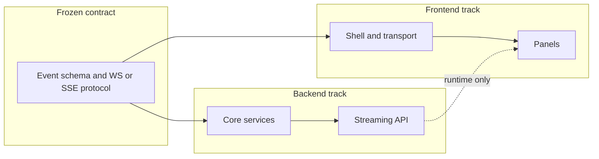

# Multi-Agent Code Review System — Implementation Plan

This plan follows [PROJECT_REQUIREMENTS.md](PROJECT_REQUIREMENTS.md). The repo currently has no application code; [STREAMING_EVENTS_SPEC.md](STREAMING_EVENTS_SPEC.md) and `test_cases/` are **referenced by the requirements but not in the workspace yet**—early steps assume you will **author the event spec** and **add or generate** the test fixtures described in the doc.

### LLM provider: MiniMax (not Anthropic credits)

[PROJECT_REQUIREMENTS.md](PROJECT_REQUIREMENTS.md) names **Anthropic Claude** as the required LLM. This plan **implements the same agent behavior using MiniMax** (`[MiniMax-M2.7](https://platform.minimax.io/docs/llms.txt)`) because you are **not using Anthropic credits**. **Action:** Confirm with the assessor that substituting MiniMax is acceptable, or document the deviation clearly in README and any submission notes.

**Integration options (pick one stack and stick to it):**

| Approach                 | Env vars (international)                                                   | SDK                    | Notes                                                                                                                                                                                                                                 |
| ------------------------ | -------------------------------------------------------------------------- | ---------------------- | ------------------------------------------------------------------------------------------------------------------------------------------------------------------------------------------------------------------------------------- |
| **Anthropic-compatible** | `ANTHROPIC_BASE_URL=https://api.minimax.io/anthropic`, `ANTHROPIC_API_KEY` | `anthropic` Python SDK | `messages.create(model="MiniMax-M2.7", ...)`. Process `thinking` / `text` / `tool_use` blocks; **append full `response.content`** on each turn for tool loops.                                                                        |
| **OpenAI-compatible**    | `OPENAI_BASE_URL=https://api.minimax.io/v1`, `OPENAI_API_KEY`              | `openai` Python SDK    | `chat.completions.create(model="MiniMax-M2.7", ...)`. Use `extra_body={"reasoning_split": True}` for interleaved reasoning in `reasoning_details`; **preserve full assistant messages** (including `reasoning_details`) across turns. |

**Streaming for UI “thinking” events:** Use the provider’s streaming API and map **reasoning / thinking deltas** to your `thinking` event stream (OpenAI: stream `reasoning_details` text; Anthropic path: stream `thinking` blocks). See MiniMax docs index: `https://platform.minimax.io/docs/llms.txt` for the full page list before deep-diving.

## Dependency model (how to read this plan)

- **Objective**: Each numbered step below has one clear outcome. Complex areas are split into two steps.
- **Backend vs frontend**: Backend steps live under **Backend track**; frontend under **Frontend track**. They only meet at a **frozen contract** (event JSON shape + transport: WebSocket or SSE URL and message format). Frontend work can proceed using **mock events** or a stub server until the real backend exists.
- **Independence**: Steps are **sequenced within each track** where order matters. **Cross-track runtime dependency** is unavoidable for a working demo (the UI must point at a running API). Any **prerequisite** is called out with **Depends on:** so you can maintain a small doc (e.g. `docs/CROSS_STACK_DEPENDENCIES.md`) listing these links—per your request.
- **Recommended layout**: `backend/` (Python, FastAPI, agents, bus) and `frontend/` (e.g. React or vanilla)—separate `package.json` / `pyproject.toml`, separate deployables.

---

## Part A — Main requirements (backend)

| Step    | Objective                                                                                                                                                                                                                                                                                                                                                                                       | Depends on                                                                                                |
| ------- | ----------------------------------------------------------------------------------------------------------------------------------------------------------------------------------------------------------------------------------------------------------------------------------------------------------------------------------------------------------------------------------------------- | --------------------------------------------------------------------------------------------------------- |
| **B1**  | **Backend repository scaffold**: Python 3.11+, dependency file (`[pyproject.toml](pyproject.toml)` or `requirements.txt`), `backend/` package layout, `uvicorn` entrypoint stub, `.env.example` (placeholders for **MiniMax** via either `OPENAI_BASE_URL` + `OPENAI_API_KEY` or `ANTHROPIC_BASE_URL` + `ANTHROPIC_API_KEY` per integration table below) and `.gitignore` (no API keys in git). | None                                                                                                      |
| **B2**  | **Event contract in code**: Implement Pydantic (v2) models and serializers for all event types required by the doc (`event_type`, `agent_id`, ISO `timestamp`, `data`). If [STREAMING_EVENTS_SPEC.md](STREAMING_EVENTS_SPEC.md) is missing, **create it** from the requirements and keep models in lockstep with it.                                                                            | B1                                                                                                        |
| **B3**  | **Async event bus**: In-process publish/subscribe so multiple agents can emit concurrently; each consumer sees an **ordered** stream; under normal load **no drops** (queue per subscriber or equivalent).                                                                                                                                                                                      | B2                                                                                                        |
| **B4**  | **FastAPI shell + CORS**: HTTP app with health route; **CORS** configured for the separate frontend origin.                                                                                                                                                                                                                                                                                     | B1                                                                                                        |
| **B5**  | **Real-time transport**: One of WebSocket (recommended in doc) or SSE endpoint that **subscribes to the bus** and pushes `event.to_dict()` JSON **as produced** (no batching for UX).                                                                                                                                                                                                           | B3, B4                                                                                                    |
| **B6**  | **MiniMax LLM client module**: Load credentials from `.env` (see table above—either Anthropic-compat or OpenAI-compat base URL + key). Call `**MiniMax-M2.7`**. Implement streaming and map model reasoning to `**thinking`-style** events (preserve full multi-turn messages when using tools, per MiniMax guidance).                                                                          | B1                                                                                                        |
| **B7**  | `**BaseAgent` interface**: Async `analyze(code, context, event_callback) -> AgentResult` as in the requirements; shared types for findings.                                                                                                                                                                                                                                                     | B2                                                                                                        |
| **B8**  | **Security agent**: Specialist that scans for injection, secrets, auth issues, XSS, unsafe deserialization, etc.; emits `agent_started`, streaming `thinking`, `tool_call`_*, `finding_discovered`, `agent_completed`.                                                                                                                                                                          | B6, B7                                                                                                    |
| **B9**  | **Bug detection agent**: Same **event contract** as security; focuses on null refs, logic, types, races, leaks, error handling.                                                                                                                                                                                                                                                                 | B6, B7                                                                                                    |
| **B10** | **Coordinator agent**: Parse/plan structure, emit `plan_created`, `agent_delegated`, run specialists (via coordinator only per spec), merge findings, resolve conflicts, emit `findings_consolidated` and `final_report`.                                                                                                                                                                       | B8, B9                                                                                                    |
| **B11** | **Review session wiring**: Endpoint or WS handshake that accepts Python source (+ metadata), runs the coordinator pipeline, and **fans all agent events** into the bus for B5.                                                                                                                                                                                                                  | B5, B10                                                                                                   |
| **B12** | **Fix lifecycle events**: When applicable, emit `fix_proposed` and optionally `fix_verified` (syntax/type/test checks as feasible); if verification is skipped, still emit `fix_proposed` only.                                                                                                                                                                                                 | B8, B9 (or B11 if fixes emitted only after consolidation—either is valid; document chosen rule in README) |

---

## Part B — Main requirements (frontend)

| Step   | Objective                                                                                                                                                                                                                   | Depends on                                                                         |
| ------ | --------------------------------------------------------------------------------------------------------------------------------------------------------------------------------------------------------------------------- | ---------------------------------------------------------------------------------- |
| **F1** | **Frontend scaffold**: Separate app under `frontend/` (React or vanilla per doc), build/dev server, environment variable for **API/WebSocket base URL** only (no backend code in this tree).                                | None (use mock JSON fixtures shaped per B2 contract)                               |
| **F2** | **Transport layer**: WebSocket or **EventSource** client, **no polling**, parse incoming JSON events, single module that normalizes `event_type` for the UI.                                                                | F1; **contract**: event shapes from B2 (doc/mock, not necessarily running backend) |
| **F3** | **Agent status panel**: Map events to states `idle` / `thinking` / `tool_calling` / `completed` / `error` for Coordinator, Security, Bug.                                                                                   | F2                                                                                 |
| **F4** | **Live thought stream**: Append streaming `thinking` content per agent in real time.                                                                                                                                        | F2                                                                                 |
| **F5** | **Tool activity log**: List `tool_call_start` / `tool_call_result` with inputs, outputs, duration when present.                                                                                                             | F2                                                                                 |
| **F6** | **Findings feed**: Real-time list of findings with severity; hooks for “view details” / “view fix” using `fix_proposed` data when available.                                                                                | F2                                                                                 |
| **F7** | **Execution plan UI**: Display coordinator plan steps and progress from `plan_created` and related lifecycle events.                                                                                                        | F2                                                                                 |
| **F8** | **Code submission UX**: Textarea or file input to send Python code to the backend **start-review** mechanism; **runtime Depends on:** B11 + B5 deployed (document this as the only mandatory cross-stack coupling for E2E). | F2                                                                                 |

---

## Part C — Test harness and quality (backend-oriented)

| Step   | Objective                                                                                                                                                                                                  | Depends on                                                                |
| ------ | ---------------------------------------------------------------------------------------------------------------------------------------------------------------------------------------------------------- | ------------------------------------------------------------------------- |
| **T1** | **Test fixtures**: Populate `test_cases/buggy_samples/` and `test_cases/expected_findings.json` as specified (if not provided externally).                                                                 | None                                                                      |
| **T2** | `**evaluate.py`**: Batch runner over samples, invoke the **same analysis path** as production (or shared library), compute precision, recall, F1, fix success rate vs expected JSON; write `metrics.json`. | B10 or B11 (needs stable programmatic entry to run review without UI); T1 |

---

## Part D — Additional requirements (bonus + submission)

Treat these as **separate steps** after Parts A–C; each is one objective.

**Bonus (from [PROJECT_REQUIREMENTS.md](PROJECT_REQUIREMENTS.md) §Bonus Features)**

| Step    | Objective                                                                               |
| ------- | --------------------------------------------------------------------------------------- |
| **X1**  | RAG over Python docs for richer analysis.                                               |
| **X2**  | Custom MCP tool for code execution (if you use MCP in this environment).                |
| **X3**  | AWS design doc: Lambda + API Gateway style architecture.                                |
| **X4**  | Polished web UI (visual design pass beyond functional panels).                          |
| **X5**  | Raise verified fix rate above 70% (iterate prompts/tools in B12).                       |
| **X6**  | Additional specialist agent (e.g. style or performance).                                |
| **X7**  | Optional direct agent-to-agent messaging (bonus; coordinator remains primary per spec). |
| **X8**  | Multi-turn conversation history for reviews.                                            |
| **X9**  | Token usage tracking / cost optimization.                                               |
| **X10** | Caching repeated patterns.                                                              |
| **X11** | Configuration UI for agent behavior.                                                    |

**Submission checklist (documentation)**

| Step   | Objective                                                                                                                                                                               |
| ------ | --------------------------------------------------------------------------------------------------------------------------------------------------------------------------------------- |
| **S1** | README: clone-to-run, architecture diagram, how to run backend and frontend separately, env vars (**include MiniMax setup** and note if the official assessment asked for Claude-only). |
| **S2** | `TIME_ESTIMATION.md`: estimated vs actual hours.                                                                                                                                        |
| **S3** | `BLOCKERS_AND_SOLUTIONS.md`: challenges and resolutions.                                                                                                                                |
| **S4** | `presentation_outline.md`: demo flow.                                                                                                                                                   |

---

## Explicit cross-stack dependency summary (for your documentation file)

- **F2–F7** need the **event schema** from **B2** (documentation or mocks); they do not need the Python server to be written first.
- **F8** needs **B5 + B11** running and reachable at the configured base URL.
- **T2** needs a **stable programmatic API** from the same core as **B11** (avoid duplicating orchestration logic only in the CLI).

---

## Suggested execution order (milestones)

1. **Milestone 1 — Contract**: B1, B2, F1 in parallel; add `docs/CROSS_STACK_DEPENDENCIES.md` when B2 is stable.
2. **Milestone 2 — Visible streaming**: B3 → B4 → B5; F2 → F3 (minimal “hello events”).
3. **Milestone 3 — Intelligence**: B6 → B7 → B8 → B9 → B10 → B11 → B12.
4. **Milestone 4 — UI complete**: F4 → F5 → F6 → F7 → F8.
5. **Milestone 5 — Evaluation**: T1 → T2.
6. **Milestone 6 — Extras**: X* then S*.

This keeps **backend steps** and **frontend steps** in distinct lists, splits heavy areas (e.g. B8/B9 separate from B10), and records **Depends on** wherever work truly cannot be arbitrary-ordered.